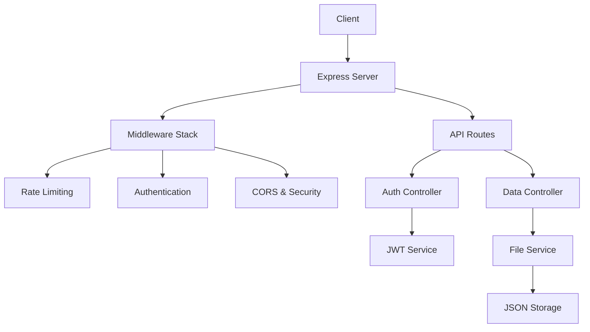
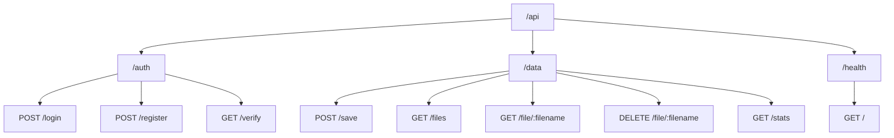
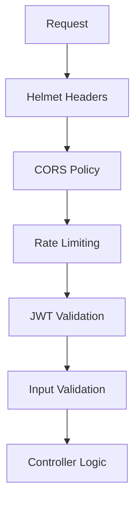

# VicSam Group API 🚀

API REST moderna per la gestione dei dati del gruppo VicSam, costruita con Node.js ed Express

## 📋 Panoramica

L'API VicSam Group è un server backend robusto che fornisce:
- ✅ Autenticazione JWT sicura
- 📊 Gestione dati con validazione
- 🔒 Middleware di sicurezza avanzati
- 🧪 Suite di test completa
- 📈 Monitoraggio e logging

## 🏗️ Architettura



## 🛠️ Stack Tecnologico

| Categoria | Tecnologia |
|-----------|------------|
| **Runtime** | Node.js 20.x |
| **Framework** | Express.js |
| **Autenticazione** | JWT + bcryptjs |
| **Sicurezza** | Helmet, CORS, Rate Limiting |
| **Validazione** | Joi |
| **Testing** | Jest + Supertest |
| **Development** | Nodemon |

## 🚦 Endpoints API



### 🔐 Autenticazione

| Endpoint | Metodo | Descrizione | Auth |
|----------|--------|-------------|------|
| `/api/auth/login` | POST | Login con password | ❌ |
| `/api/auth/verify` | GET | Verifica token Bearer | ✅ |

### 📊 Gestione Dati

| Endpoint | Metodo | Descrizione | Auth |
|----------|--------|-------------|------|
| `/api/data/save` | POST | Salva nuovi dati | ✅ |
| `/api/data/files` | GET | Lista tutti i file | ✅ |
| `/api/data/file/:filename` | GET | Contenuto di un file | ✅ |
| `/api/data/file/:filename` | DELETE | Elimina un file | ✅ |
| `/api/data/stats` | GET | Statistiche sui dati | ✅ |

### 🏥 Monitoraggio

| Endpoint | Metodo | Descrizione | Auth |
|----------|--------|-------------|------|
| `/health` | GET | Stato del server | ❌ |

## ⚡ Quick Start

### GitHub Codespaces (Consigliato) ☁️
```bash
# Avvio automatico con configurazione Codespaces
./start-codespaces.sh
```

### Sviluppo Locale 💻
```bash
# Installa le dipendenze
npm install

# Avvia il server in modalità sviluppo
npm run dev

# Oppure avvia il server in produzione
npm start
```

L'API sarà disponibile su `http://localhost:3000`

### Frontend React 🎨
```bash
cd client
npm install
npm run dev
```

Il frontend sarà disponibile su `http://localhost:5173`

## ⚙️ Configurazione per GitHub Codespaces

Il progetto include supporto completo per GitHub Codespaces con:
- Auto-rilevamento dell'ambiente Codespaces
- Configurazione automatica dell'URL del backend
- Script di avvio automatico (`start-codespaces.sh`)
- Banner di configurazione intelligente nel frontend

Vedi [client/CODESPACES_CONFIG.md](./client/CODESPACES_CONFIG.md) per dettagli.

### Installazione
```bash
# Clona il repository
git clone <repository-url>
cd vicsam-group

# Installa le dipendenze
npm install

# Configura le variabili d'ambiente
cp .env.example .env
```

### Configurazione

Crea un file `.env` nella root del progetto:

```env
PORT=3000
JWT_SECRET=your-super-secret-jwt-key
NODE_ENV=development
```

### Avvio

```bash
# Modalità sviluppo (con auto-reload)
npm run dev

# Modalità produzione
npm start
```

Il server sarà disponibile su `http://localhost:3000`

## 🧪 Testing

```bash
# Esegui tutti i test
npm test

# Test in modalità watch
npm run test:watch

# Test con coverage
npm run test:coverage

# Test per CI/CD
npm run test:ci
```

## 🔒 Sicurezza

L'API implementa multiple misure di sicurezza:



- **Helmet**: Headers di sicurezza HTTP
- **CORS**: Controllo origine richieste
- **Rate Limiting**: Protezione da attacchi DDoS
- **JWT**: Token sicuri per autenticazione
- **Validation**: Validazione input con Joi

## 📁 Struttura Progetto

```
vicsam-group/
├── 📂 api/
│   ├── 📂 controllers/     # Logic di business
│   ├── 📂 middleware/      # Middleware personalizzati
│   ├── 📂 routes/          # Definizione routes
│   ├── 📂 services/        # Servizi applicativi
│   └── 📂 utils/           # Utilità e helpers
├── 📂 __tests__/           # Suite di test
├── 📂 client/              # Frontend (opzionale)
├── 📄 server.js            # Entry point dell'app
├── 📄 package.json         # Dipendenze e scripts
└── 📄 Dockerfile           # Container Docker
```

## 🐳 Docker

### Build e Run

```bash
# Build dell'immagine
docker build -t vicsam-group-api .

# Run del container
docker run -p 3000:3000 --env-file .env vicsam-group-api

# Con Docker Compose
docker-compose up -d
```

## 🚀 Deployment

### Ambiente di Produzione

1. **Variabili d'ambiente**: Configura tutte le variabili necessarie
2. **SSL/TLS**: Usa un reverse proxy (nginx/Apache)
3. **Process Manager**: Usa PM2 o simili per la gestione dei processi
4. **Monitoring**: Implementa logging e monitoring

### CI/CD

Il progetto include workflow GitHub Actions per:
- ✅ Test automatici sui PR
- 🌙 Test notturni estesi
- 🔍 Scansioni di sicurezza
- 📦 Controllo dipendenze

## 📝 License

Distribuito sotto licenza MIT. Vedi `LICENSE` per maggiori informazioni.

## 🔗 Link Utili

- [Express.js Documentation](https://expressjs.com/)
- [JWT.io](https://jwt.io/)
- [Jest Testing Framework](https://jestjs.io/)

---

Sviluppato con ❤️ da Berry
